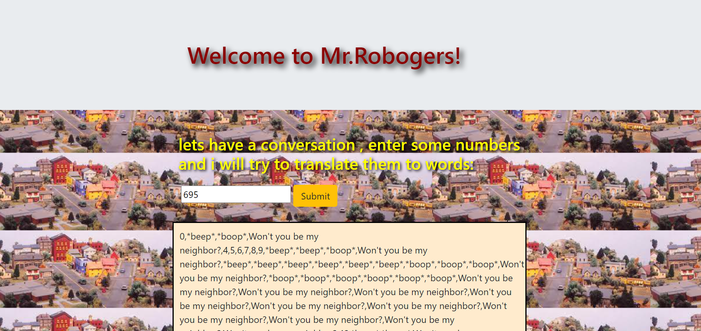

# programming-laguage-suggestor

_Author: PJ Perry_

## Summary:

week 3 epicodus project

## Technologies used:

- HTML
- CSS
- boostrap
- javascript
- jquery

## Description:
website that takes user input and changes every number with 3 to "Won't you be my neighbor?" number 2 to *boop* every number with 1 to *beep*

## Setup/installation instructions:

### visit:https://github.com/Jamesp92/Mr.Robogers
 * clone from repository
 * find in your local directory 
 * open in your local browser 

## Known bugs:

none yet .

## test.
Describe userInputNumbers()

Test: should return a new array with numbers between 0 and the number the user inputs .
Code: Input (7); 
Expected Output: [ 0,1,2,3,4,5,6,7 ]

test : every number will come back as a string and every number with 3 in it  should be replaced with "wont you be my neighbor" 
code: Input  (5)
expected output : [" 0,1,2,"wont you be my neighbor",4,5 ]

test :every number will come back as a string and every number with  2 in it  should be replaced with "boop" 
code: userInput  (5)
expected output : [ 0,1,"boop",3,4,5 ]

test : every number will come back as a string and every number with number 1 in it should be replaced with "beep" 
code: Input (5)
expected output : [ 0,"beep",2,3,4,5 ]
